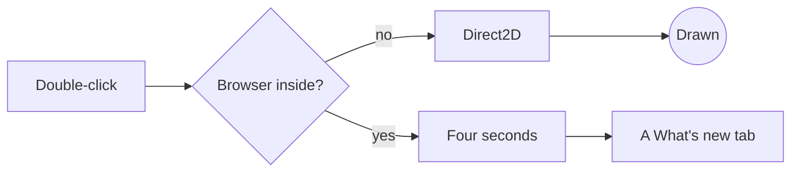
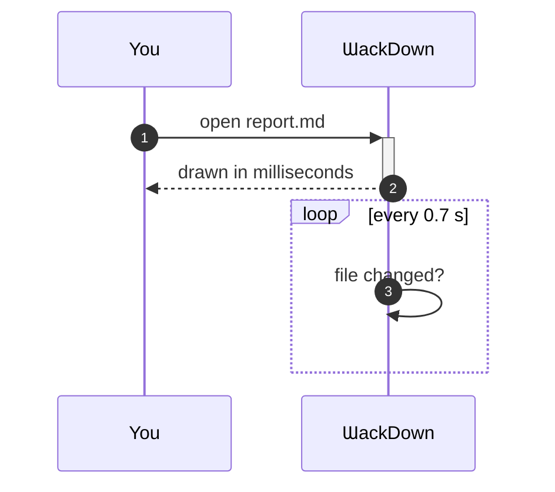
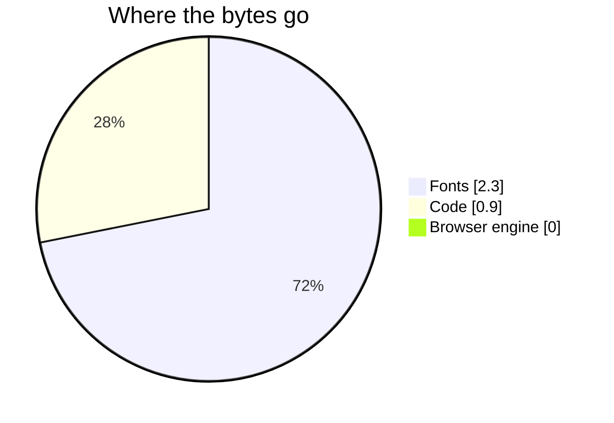

# How a file gets opened

```mermaid
flowchart LR
    A[Double-click] --> B{Browser inside?}
    B -->|no| C[Direct2D] --> E((Drawn))
    B -->|yes| D[Four seconds] --> F[A What's new tab]
```

```mermaid
sequenceDiagram
    autonumber
    participant You
    participant W as ƜackDown
    You->>+W: open report.md
    W-->>-You: drawn in milliseconds
    loop every 0.7 s
        W->>W: file changed?
    end
```

```mermaid
pie showData title Where the bytes go
    "Fonts" : 2.3
    "Code" : 0.9
    "Browser engine" : 0
```
